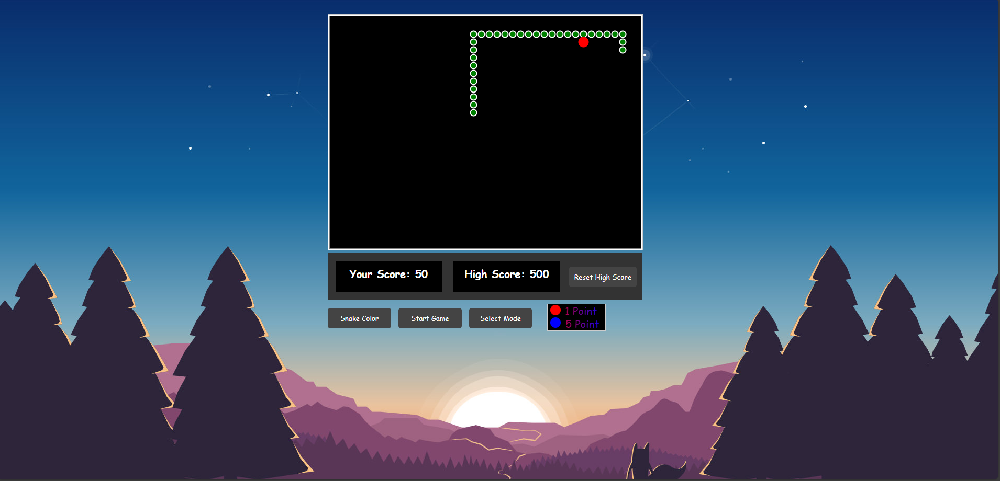
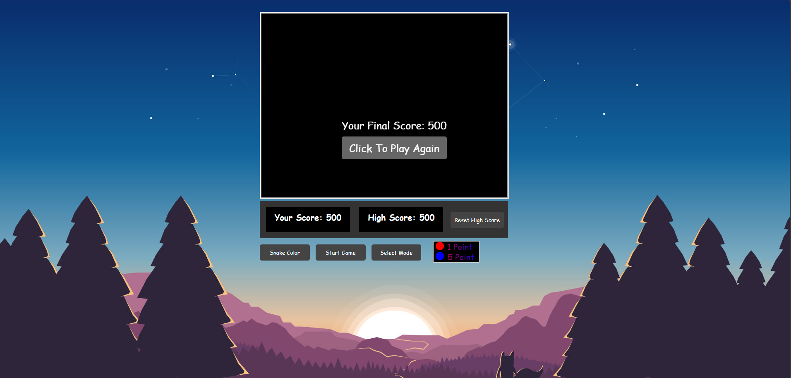

# Snake Feast


---

<table>
  <tr>
    <td>
      
    </td>
    <td>
      <strong>You can find the project on the Microsoft Store:</strong>
      <ul>
        <li><strong>Store ID</strong>: 9PC2Z9NGJKKT</li>
        <li><strong>Web Store URL</strong>: 
            <a href="https://www.microsoft.com/store/apps/9PC2Z9NGJKKT" target="_blank">Snake Feast on Microsoft Store</a>
        </li>
        <li><strong>Deep Link (for Windows Store App)</strong>: 
            <a href="ms-windows-store://pdp/?productid=9PC2Z9NGJKKT">Open in Microsoft Store App</a>
        </li>
      </ul>
    </td>
  </tr>
</table>

  
You can also play the game on the web:

- **Play Snake Feast online**: [Snake Feast on Netlify](https://feast-snake.netlify.app)

> **Note**: This game is primarily designed for desktop use.

---
Snake Feast is a simple yet fun classic arcade game developed using HTML, CSS, and JavaScript. The objective is to guide the snake to eat food, grow longer, and avoid colliding with walls or the snake's own body. It’s lightweight, responsive, and runs smoothly in the browser.

## Features
- **Classic Gameplay**: Navigate the snake to eat food and grow longer.
- **Responsive Design**: Works on desktops, tablets, and mobile devices.
- **Gradient Text Title**: Eye-catching gradient text in the game header.
- **Customizable Difficulty**: Change difficulty levels through the dropdown menu.
- **Keyboard Controls**: Use arrow keys for movement.
- **Snake Skin Color Customization**: Already implemented to enhance gameplay.


## Screenshots

<p align="center">
  <a href="https://github.com/raghul-tech/Snake-Feast.git">
    
  </a>
</p>

<p align="center">
  <a href="https://github.com/raghul-tech/Snake-Feast.git">
    
  </a>
</p>

<p align="center">
  <a href="https://github.com/raghul-tech/Snake-Feast.git">
    
  </a>
</p>

## Getting Started
### Prerequisites
To run Snake Feast, you need a modern web browser.

### Installation
1. Clone the repository:
   ```bash
   git clone https://github.com/raghul-tech/Snake-Feast.git
   ```
2. Navigate to the project directory:
   ```bash
   cd Snake-Feast
   ```
3. Open the **`index.html`** file in your browser

### Usage
- Open the game and press "Start" to begin.
- Use the arrow keys to control the snake.
- Try to eat as much food as possible without hitting the walls or your own body.

### Future Enhancements
- Adding levels with increasing complexity.
- Introducing themes for the snake.

### Download and Install
You can download the game directly from the [Microsoft Store](https://www.microsoft.com/store/apps/9PC2Z9NGJKKT).

### How to Install
1. Download the game from the [Microsoft Store](https://www.microsoft.com/store/apps/9PC2Z9NGJKKT).
2. Open the game and press "Start" to begin.

## Contributing
Contributions are welcome! If you'd like to contribute to Snake Feast, please fork the repository and submit a pull request.

## License
This project is licensed under the  GNU General Public License (GPL v3).

## Contact
Developed by [Raghul John R](https://www.linkedin.com/in/raghul-john-r-3a9577320).
