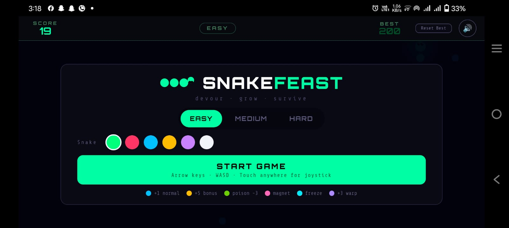
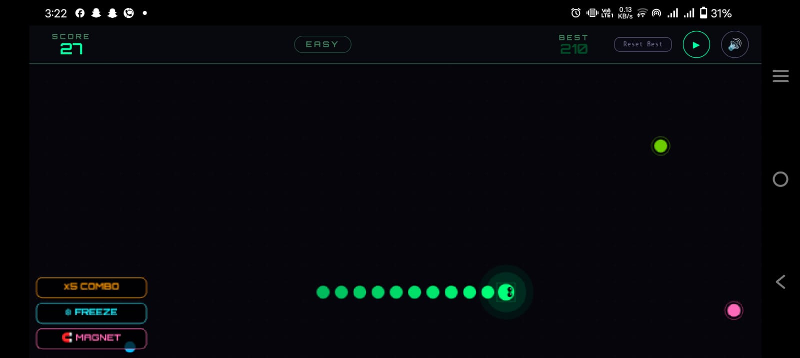
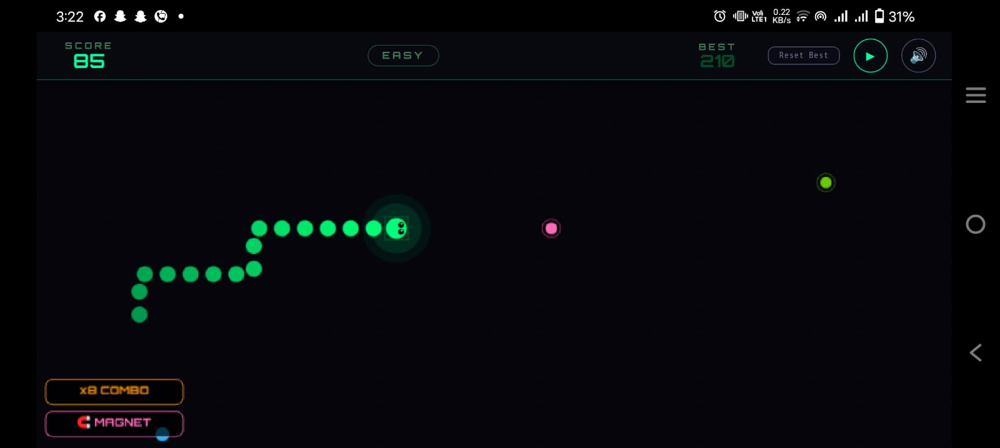
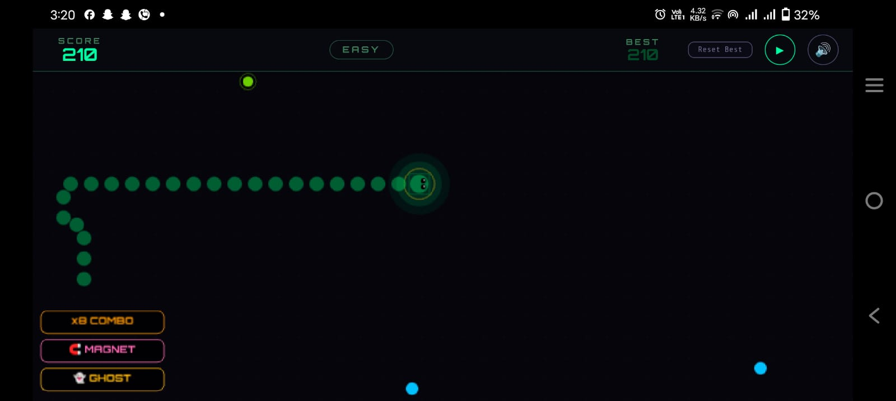
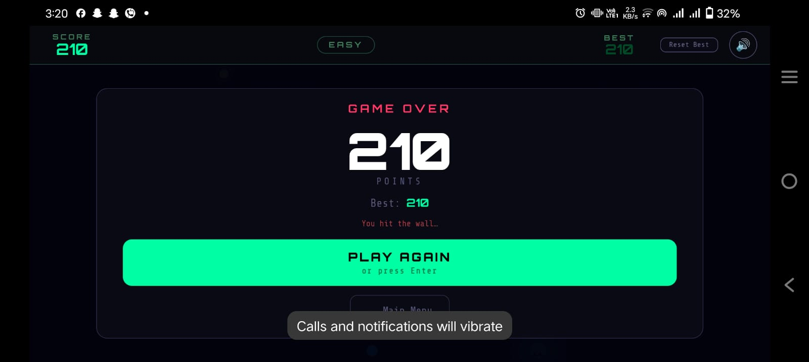

<p align="center">
  
</p>

<h1 align="center">
  Snake Feast
</h1>

<p align="center">
  <b>A modern, feature-rich Snake arcade game built with Phaser 3 & Web Audio API.</b><br />
  Control your snake, collect unique power-up foods, build high score combos, unlock achievements, and customize skin colors!
</p>

<p align="center">
  <a href="https://snake-feast-web.netlify.app/">
    
  </a>
  <a href="https://wavedash.com/g/raghul-tech/snake-feast">
    
  </a>
  <a href="https://play.google.com/store/apps/details?id=io.github.raghultech.snakefeast">
    
  </a>
  <a href="https://apps.microsoft.com/detail/9pc2z9ngjkkt">
    
  </a>
  <a href="https://marketplace.visualstudio.com/items?itemName=raghul-tech.snake-feast">
    
  </a>
</p>

<p align="center">
  <a href="https://chromewebstore.google.com/detail/snake-feast/hfmacflbnmdcjlilbnhflplpaaocaohp">
    
  </a>
  <a href="https://addons.mozilla.org/en-GB/firefox/addon/snake-feast/">
    
  </a>
  <a href="https://microsoftedge.microsoft.com/addons/detail/jlibkeadeilgolekhdoefckmknpmaiik">
    
  </a>
</p>

<p align="center">
  <a href="https://sourceforge.net/projects/snake-feast/">
    
  </a>
  <a href="https://raghul-tech.itch.io/snake-feast">
    
  </a>
  <a href="https://open-vsx.org/extension/raghul-tech/snake-feast">
    
  </a>
  <a href="LICENSE">
    
  </a>
</p>

<p align="center">
  <a href="https://discord.gg/jSsVVQHWS6">
    
  </a>
  <a href="https://buymeacoffee.com/raghultech">
    
  </a>
</p>

---

## 📖 About Snake Feast

**Snake Feast** redefines the classic snake game into a vibrant, high-energy arcade experience. Powered by **Phaser 3** and dynamic **Web Audio API** sound synthesis, Snake Feast offers seamless cross-platform gaming across Web Browsers, Windows Desktop application, Android Mobile devices, Browser Extensions, and directly within VS Code!

---

## 🎮 Game Features

- 🍎 **Six Unique Food Types**: Normal, Bonus, Poison, Magnet, Freeze, and Warp — each with distinct behaviors, visual glow effects, and synthesized audio.
- ⚡ **Power-Up System**: Active badges display active abilities such as Ghost Mode, Magnet Pull, Board Freeze, and Tunnel Warp.
- 🔥 **Combo Scoring System**: Eat food items rapidly to increase score multipliers up to **×8**.
- 🏆 **11 Unlockable Achievements**: In-game badge tracking for milestones (length, scores, and power-up usage).
- 🎨 **Skin Customization**: Personalize your snake with 6 selectable color themes.
- 🎵 **Procedural Audio Engine**: Web Audio API generates all sound effects and ambient menu music on-the-fly — no external audio files required!
- 🎚 **Three Difficulty Modes**: Easy (160ms tick), Medium (120ms tick), and Hard (80ms tick with progressive speed increments).
- 💾 **High Score Persistence**: Saves top scores per difficulty across sessions via `localStorage`, desktop JSON bridge, or Wavedash cloud storage.
- 🎮 **Cross-Platform Controls**: Arrow Keys, WASD, Touch/Swipe gestures, and D-Pad options.

---

## 📸 Platform Showcases & Screenshots

### 🌐 Web Application & Wavedash
Play instantly in your browser or compete on Wavedash global leaderboards with cloud save sync.
👉 **[Read full Web & Wavedash Documentation](web/README.md)**

<p align="center">
  
  
  
</p>

---

### 💻 Windows Desktop Application (PyQt5)
Native desktop window with window geometry memory, dark title bar, and local score bridge.
👉 **[Read full Desktop App Documentation & Build Guide](app/README.md)**

<p align="center">
  
  
</p>
<p align="center">
  
  
</p>

---

### 📱 Android Mobile Application (Capacitor)
Packaged as a native Android app with swipe gestures, touch controls, and optimized portrait/landscape views.
👉 **[Get it on Google Play Store](https://play.google.com/store/apps/details?id=io.github.raghultech.snakefeast)** • **[Read full Android App Documentation & Build Guide](android/README.md)**

<p align="center">
  
  
  
  
  
</p>

---

### 💻 VS Code Extension
Play directly in a dedicated tab inside Visual Studio Code without leaving your code editor!
👉 **[Read full VS Code Extension Documentation & Publishing Guide](vscode-extension/README.md)**

<p align="center">
  
  
  
</p>

---

### 🧩 Browser Extensions (Chrome, Firefox & Edge)
Launch Snake Feast anytime right from your browser toolbar popup.
👉 **[Read full Browser Extension Documentation & Manifest Guide](web-extension/README.md)**

<p align="center">
  
  
  
</p>

---

## 🍎 Food Types & Power-Ups

| Food | Color | Effect |
|:---:|:---:|---|
| **Normal** | 🔵 Blue | **+1 point** — Standard snake food |
| **Bonus** | 🟡 Yellow Star | **+5 points** + Temporary Ghost Mode (pass through body/walls) |
| **Poison** | 🟢 Green | **−3 points** — Shrinks snake body size |
| **Magnet** | 🩷 Pink | **Magnet Field** — Attracts nearby food toward your snake |
| **Freeze** | 🩵 Cyan | **Cryo Freeze** — Slows down movement tick speed temporarily |
| **Warp** | 🟣 Purple | **+3 points** + Ghost mode warp tunneling |

---

## 🏆 Achievements

| Icon | Achievement | Condition |
|:---:|---|---|
| 🍽 | **First Blood** | Eat your first piece of food |
| 🔟 | **Double Digits** | Reach a score of 10 |
| ⭐ | **Fifty Feast** | Reach a score of 50 |
| 💯 | **Century** | Reach a score of 100 |
| 🔥 | **Hot Streak** | Reach a ×3 combo multiplier |
| 👻 | **Phase Shift** | Collect a bonus food to trigger ghost mode |
| 🧲 | **Magnetar** | Activate the magnet power-up |
| ❄ | **Cryogenics** | Activate the freeze power-up |
| ☠ | **Toxin Proof** | Survive eating poison food |
| 🐍 | **Slitherer** | Grow snake to length 15 |
| 🐉 | **Great Serpent** | Grow snake to length 30 |

---

## 🌐 Platform Links & Download Matrix

| Platform | Category | Access / Store Link | Detailed Guide |
|---|---|---|---|
| **Web (Production)** | 🟢 Web | [Play on Netlify Web](https://snake-feast-web.netlify.app/) | [`web/README.md`](web/README.md) |
| **Wavedash** | 🟣 Leaderboards | [Play on Wavedash](https://wavedash.com/g/raghul-tech/snake-feast) | [`web/README.md`](web/README.md) |
| **Web (Staging)** | 🟡 Preview | [Play on Netlify Staging](https://snake-feast-staging.netlify.app/) | [`web/README.md`](web/README.md) |
| **Windows Desktop** | 💻 Windows | [Get from Microsoft Store](https://apps.microsoft.com/detail/9pc2z9ngjkkt) | [`app/README.md`](app/README.md) |
| **Windows Desktop** | 💻 Package | `winget install "Snake Feast"` | [`app/README.md`](app/README.md) |
| **Windows Desktop** | 💻 Download | [SourceForge](https://sourceforge.net/projects/snake-feast/) • [itch.io](https://raghul-tech.itch.io/snake-feast) | [`app/README.md`](app/README.md) |
| **Android App** | 📱 Mobile | [Get on Google Play Store](https://play.google.com/store/apps/details?id=io.github.raghultech.snakefeast) | [`android/README.md`](android/README.md) |
| **VS Code Extension** | 💻 IDE | [VS Code Marketplace](https://marketplace.visualstudio.com/items?itemName=raghul-tech.snake-feast) • [Open VSX](https://open-vsx.org/extension/raghul-tech/snake-feast) | [`vscode-extension/README.md`](vscode-extension/README.md) |
| **Chrome Extension** | 🧩 Extension | [Chrome Web Store](https://chromewebstore.google.com/detail/snake-feast/hfmacflbnmdcjlilbnhflplpaaocaohp) | [`web-extension/README.md`](web-extension/README.md) |
| **Firefox Add-on** | 🧩 Extension | [Firefox Add-ons](https://addons.mozilla.org/en-GB/firefox/addon/snake-feast/) | [`web-extension/README.md`](web-extension/README.md) |
| **Edge Extension** | 🧩 Extension | [Microsoft Edge Add-ons](https://microsoftedge.microsoft.com/addons/detail/jlibkeadeilgolekhdoefckmknpmaiik) | [`web-extension/README.md`](web-extension/README.md) |

---

## 💻 Installation & Quick Launch

### 🪟 Windows Desktop Installation
1. **Microsoft Store**: Install directly via [Microsoft Store Page](https://apps.microsoft.com/detail/9pc2z9ngjkkt).
2. **Winget Package Manager**:
   ```bash
   winget install "Snake Feast"
   ```
3. **Standalone Installer**: Download from [SourceForge](https://sourceforge.net/projects/snake-feast/) or [itch.io](https://raghul-tech.itch.io/snake-feast).

---

### 📱 Android Mobile Setup
Build and run on Android using Capacitor & Android Studio. Follow step-by-step instructions in [`android/README.md`](android/README.md).

---

### 💻 VS Code Extension Quick Launch
1. Install from [VS Code Marketplace](https://marketplace.visualstudio.com/items?itemName=raghul-tech.snake-feast).
2. Launch via:
   - **Status Bar**: Click **🐍 Snake Feast** in status bar footer.
   - **Shortcut**: `Ctrl+Shift+Alt+S` (Windows) / `Cmd+Shift+Alt+S` (Mac).
   - **Command Palette**: `Ctrl+Shift+P` → **Start Snake Feast**.

---

## 📁 Repository & Component Breakdown

Click any component below to read its dedicated README file:

- 🌐 [**Web Component** (`web/README.md`)](web/README.md) — HTML5/Phaser web game, Netlify CI/CD, Wavedash SDK deployment.
- 💻 [**Desktop Application** (`app/README.md`)](app/README.md) — PyQt5 + QWebEngine wrapper for Windows with native dark titlebar.
- 📱 [**Android Mobile App** (`android/README.md`)](android/README.md) — Capacitor Android wrapper, Gradle build scripts, AAB packaging.
- 💻 [**VS Code Extension** (`vscode-extension/README.md`)](vscode-extension/README.md) — Webview extension source, `vsce` packaging, Open VSX publishing.
- 🧩 [**Browser Extensions** (`web-extension/README.md`)](web-extension/README.md) — Chrome MV3, Firefox MV2, Edge MV3 manifest configurations & zip release guide.

---

## 🛠 Tech Stack

- **Game Engine**: [Phaser 3](https://phaser.io/)
- **Audio Engine**: Synthesized via Web Audio API (no external sound files required)
- **Desktop Wrapper**: Python 3, PyQt5, QtWebEngine
- **Mobile Wrapper**: Ionic Capacitor
- **IDE Integration**: VS Code Webview API
- **Deployment & Hosting**: Netlify CI/CD, Wavedash Cloud SDK

---

## 🤝 Contributing

Contributions, bug reports, and feature requests are welcome!

1. Fork the repository.
2. Create a feature branch (`git checkout -b feature/AmazingFeature`).
3. Commit your changes (`git commit -m 'Add AmazingFeature'`).
4. Push to the branch (`git push origin feature/AmazingFeature`).
5. Open a Pull Request.

Please review [CONTRIBUTING.md](CONTRIBUTING.md) and [CODE_OF_CONDUCT.md](CODE_OF_CONDUCT.md) before contributing.

---

## 🐛 Bug Reports & Community

- **Report Bugs**: [GitHub Issue Tracker](https://github.com/raghul-tech/Snake-Feast/issues/new?template=bug_report.md)
- **Discord Community**: [Join Snake Feast Discord](https://discord.gg/jSsVVQHWS6)
- **Developer Email**: [raghultech.app@gmail.com](mailto:raghultech.app@gmail.com)
- **Support Project**: [Buy Me A Coffee](https://buymeacoffee.com/raghultech)

---

## 📜 License

Distributed under the **GNU General Public License v3.0 (GPL-3.0)**. See [`LICENSE`](LICENSE) for details.


