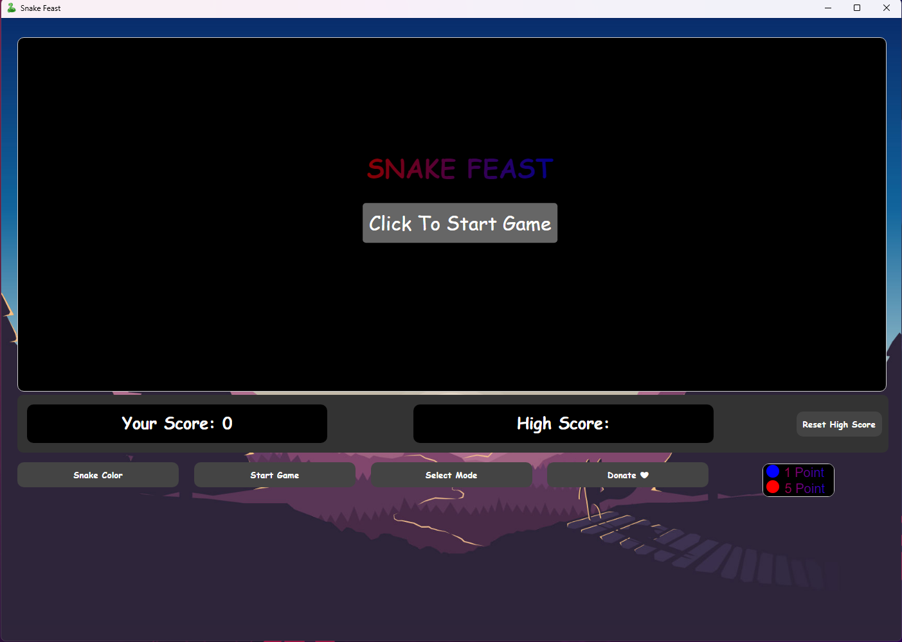
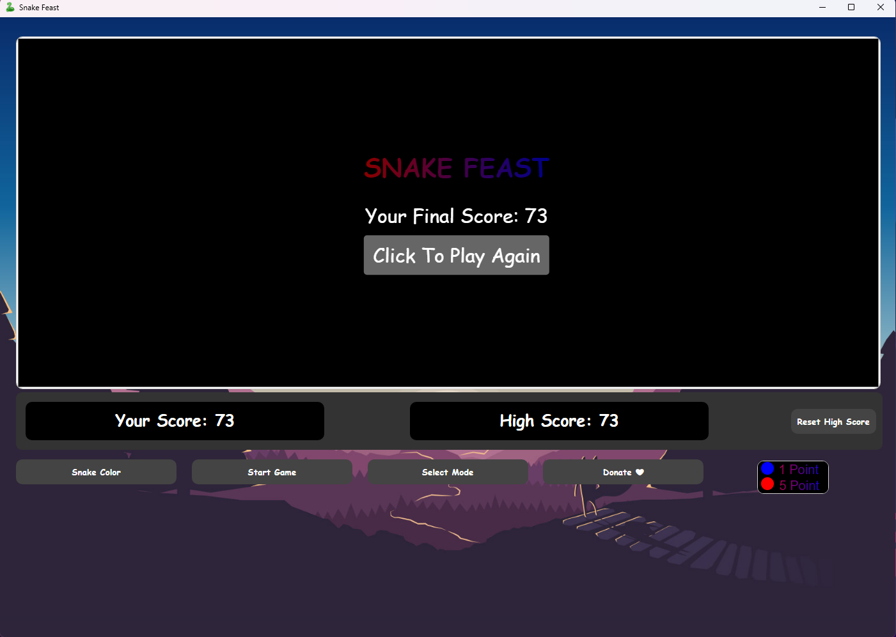

<p align="center">

</p>
<h1 align="center">
  Snake Feast
</h1>
<p align="center">
 Snake Feast: Control a snake, eat food, grow longer, and challenge your reflexes in this fun game. Aim for high score
</p>
<p align="center">
  <a style="text-decoration:none" href="https://apps.microsoft.com/detail/9pc2z9ngjkkt?hl=en-gb&gl=IN">
    
  </a>
  <a style="text-decoration:none" href="https://github.com/raghul-tech/Snake-Feast/releases">
    
  </a>
  <a style="text-decoration:none">
    
  </a>
  <a style="text-decoration:none" href="https://discord.gg/jSsVVQHWS6">
    
  </a>
</p>

<p align="center">
  <a style="text-decoration:none" href="https://raghul-tech.itch.io/snake-feast">
    
  </a>
  <a style="text-decoration:none" href="https://sourceforge.net/projects/snake-feast/">
    
  </a>
  
</p>

<p align="center">
  <a href="https://buymeacoffee.com/raghultech">
    
  </a>
</p>


# Snake Feast

Snake Feast is a simple yet fun classic arcade game developed using HTML, CSS, and JavaScript. The objective is to guide the snake to eat food, grow longer, and avoid colliding with walls or the snake's own body. It’s lightweight, responsive, and runs smoothly in the browser.

## Features
- **Classic Gameplay**: Navigate the snake to eat food and grow longer.
- **Responsive Design**: Works on desktops, tablets, and mobile devices.
- **Gradient Text Title**: Eye-catching gradient text in the game header.
- **Customizable Difficulty**: Change difficulty levels through the dropdown menu.
- **Keyboard Controls**: Use arrow keys or WASD keys for navigation.
- **Snake Skin Color Customization**: Already implemented to enhance gameplay.


## Snapshots

<p align="center">
  <a href="https://github.com/raghul-tech/Snake-Feast.git">
    
  </a>
</p>

<p align="center">
  <a href="https://github.com/raghul-tech/Snake-Feast.git">
    
  </a>
</p>

<p align="center">
  <a href="https://github.com/raghul-tech/Snake-Feast.git">
    
  </a>
</p>

## Getting Started
### Prerequisites

### Installation

<table>
  <tr>
    <td>
      
    </td>
    <td>
      <strong>You can find the project on the Microsoft Store:</strong>
      <ul>
        <li><strong>Store ID</strong>: 9PC2Z9NGJKKT</li>
        <li><strong>Web Store URL</strong>: 
          <a href="https://www.microsoft.com/store/apps/9PC2Z9NGJKKT" target="_blank">Snake Feast on Microsoft Store</a>
        </li>
        <li><strong>Alternate Web Store URL</strong>: 
          <a href="https://apps.microsoft.com/store/detail/9PC2Z9NGJKKT?cid=DevShareMCLPCS" target="_blank">Snake Feast Alternate Store Link</a>
        </li>
        <li><strong>Deep Link (for Windows Store App)</strong>: 
          <a href="ms-windows-store://pdp/?productid=9PC2Z9NGJKKT">Open in Microsoft Store App</a>
        </li>
      </ul>
    </td>
  </tr>
  <tr>
    <td>
      <a href="https://raghul-tech.itch.io/snake-feast" target="_blank" rel="noopener noreferrer">
        
      </a>
    </td>
    <td>
     <a href="https://sourceforge.net/p/snake-feast/"></a>
      <br />
      <a href="https://sourceforge.net/projects/snake-feast/files/latest/download"></a>
    </td>
  </tr>
</table>

Snake Feast  is available for **Windows** and **Linux**

## Available Extensions

<table>
  <tr>
    <td>
      
    </td>
    <td>
      <strong>Snake Feast Firefox Extension</strong>:
      <ul>
        <li><a href="https://addons.mozilla.org/en-GB/firefox/addon/snake-feast/" target="_blank">Install on Firefox</a></li>
      </ul>
    </td>
  </tr>
  <tr>
    <td>
      
    </td>
    <td>
      <strong>Snake Feast Chrome Extension</strong>:
      <ul>
        <li><a href="https://chromewebstore.google.com/detail/snake-feast/hfmacflbnmdcjlilbnhflplpaaocaohp?hl=en-GB&authuser=0" target="_blank">Install on Chrome</a></li>
      </ul>
    </td>
  </tr>
  <tr>
    <td>
      
    </td>
    <td>
      <strong>Snake Feast Edge Extension</strong>:
      <ul>
        <li><a href="https://microsoftedge.microsoft.com/addons/detail/jlibkeadeilgolekhdoefckmknpmaiik" target="_blank">Install on Edge</a></li>
      </ul>
    </td>
  </tr>
</table>

---

You can also play the game on the web:

- **Play Snake Feast online**: [Snake Feast on Netlify](https://feast-snake.netlify.app/#)

---

# How to Download and Install

## For Windows
1. **From Microsoft Store**  
   - Download the installer from the [Microsoft Store](https://apps.microsoft.com/store/detail/9PC2Z9NGJKKT?cid=DevShareMCLPCS).  
   - Run the installer, and it will redirect you to the Microsoft Store to complete the installation.

2. **Using Winget**  
   - Open Command Prompt or PowerShell.  
   - Run the following command to install NotepadXX:  
     ```bash
     winget install "Snake Feast"
     ```

---

## For Linux
1. **Download the `.tar.gz` File**  
   - Visit [SourceForge](https://sourceforge.net/projects/snake-feast/) or [itch.io](https://raghul-tech.itch.io/snake-feast) and download the Linux version of the `.tar.gz` file:  
     **NotepadXXV1.1.0-Installer(Linux).tar.gz**

2. **Extract the File**  
   - Open a terminal and navigate to the directory where the `.tar.gz` file was downloaded.
   - Use the following command to extract the file:  
     ```bash
     tar -xvzf "SnakeFeastv1.1.3-Installer.tar.gz"
     ```

3. **Make the Installer Executable**  
   - Navigate to the extracted folder:  
     ```bash
     cd "SnakeFeast1.1.3-Installer"
     ```
   - Run the following command to make the `install.sh` script executable:  
     ```bash
     chmod +x install.sh
     ```

4. **Run the Installer**  
   - Execute the installer with this command:  
     ```bash
     ./install.sh
     ```
   - This will create shortcuts in your desktop and menubar for easy access.

## Usage
- Open the game and press "Start" to begin.
- Use the arrow keys or WASD keys to control the snake.
- Try to eat as much food as possible without hitting the walls or your own body.

## Future Enhancements
- Adding levels with increasing complexity. 
- Sound effects

## Changelog:
* View all official releases and downloads on the [Snake Feast Releases Page.](https://github.com/raghul-tech/Snake-Feast/releases)
* For a detailed log of all changes, refer to the [changelog.md](CHANGELOG.md) file.


## How to Contribute
Contributions are welcome! Follow these steps:
1. Fork the repository.
2. Create a feature branch (`git checkout -b feature-name`).
3. Commit your changes (`git commit -m "Add feature"`).
4. Push to the branch (`git push origin feature-name`).
5. Open a Pull Request.

* If you like my work, please consider:
   * Star this project on GitHub
   * Leave me a review [here](https://apps.microsoft.com/store/detail/9PC2Z9NGJKKT?cid=DevShareMCLPCS)
   * [](https://buymeacoffee.com/raghultech)
   *  If you’re interested in contributing, please [contact me](mailto:raghultech.app@gmail.com) or submit an pull request.	

## Report a Bug
   * If you've encountered a bug, please report it by clicking the link below. 
   	This will guide you through the bug-reporting process:
   	[Click here to report a bug](https://github.com/raghul-tech/Snake-Feast/issues/new?template=bug_report.md)


## License
This project is licensed under the  GNU General Public License (GPL v3).

## Contact
**Email**: [raghultech.app@gmail.com](mailto:raghultech.app@gmail.com)

## Stay tuned 📢:
* [Snake Feast Discord Server](https://discord.gg/jSsVVQHWS6)