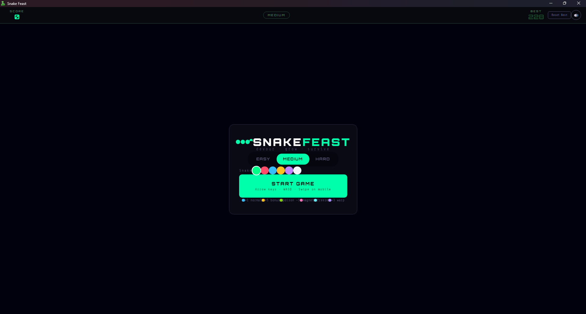
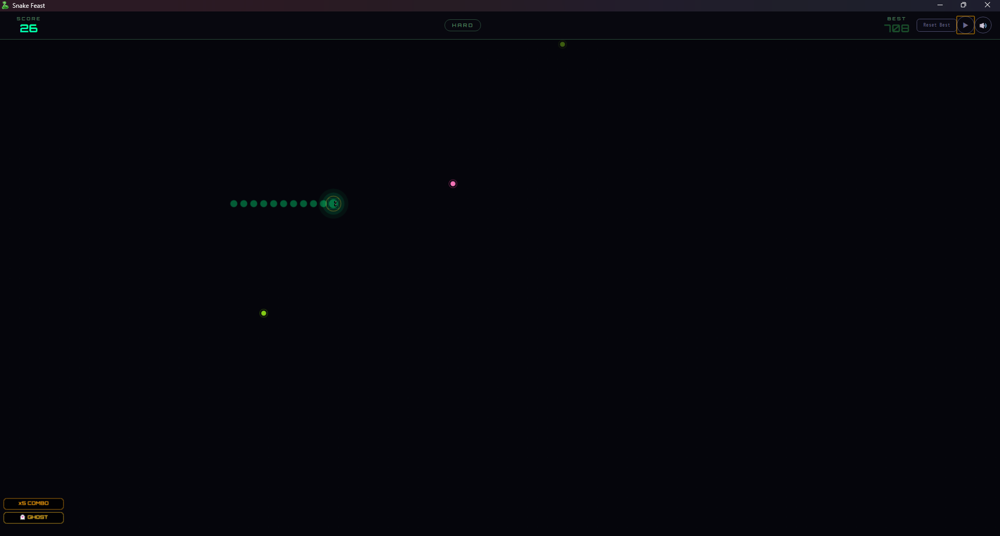
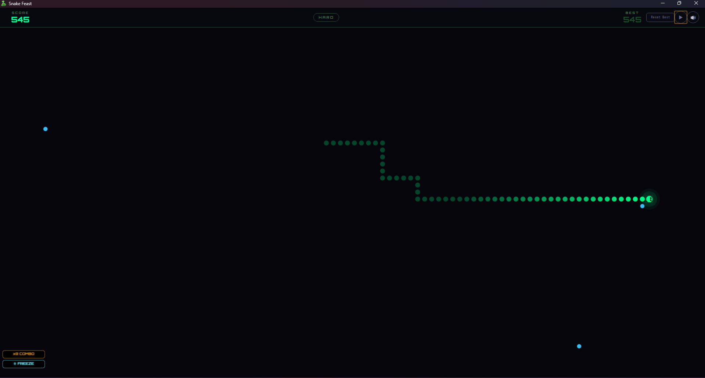
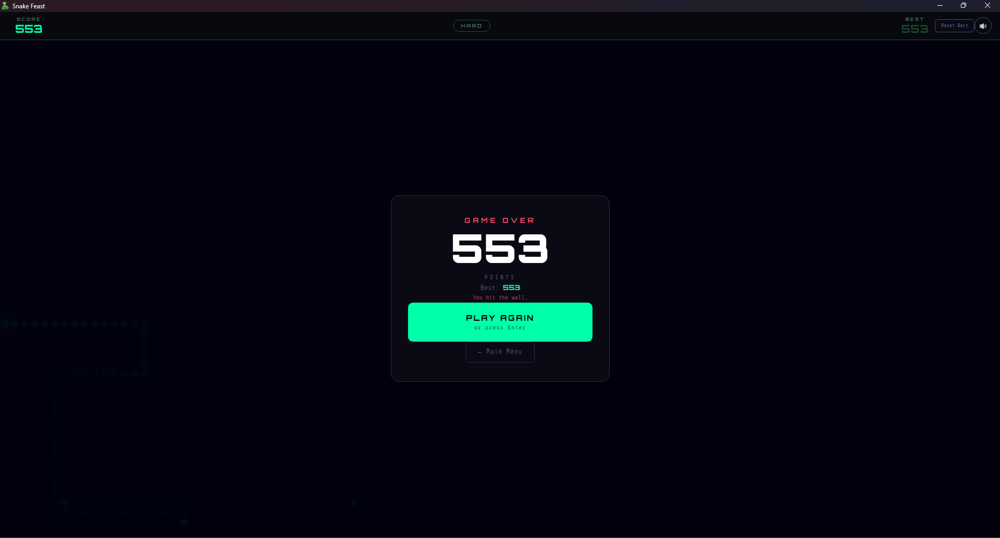

<h1 align="center">
 
 Snake Feast — Desktop Application
</h1>

<p align="center">
A modern, feature-rich Snake game that brings the classic arcade experience to your desktop. Eat food, grow longer, collect power-ups, rack up combos, and chase your high score in this beautifully crafted desktop application.
</p>

<p align="center">
  <a href="https://apps.microsoft.com/detail/9pc2z9ngjkkt?hl=en-GB&gl=AU">
    
  </a>
  <a href="https://sourceforge.net/projects/snake-feast/">
    
  </a>
  <a href="https://raghul-tech.itch.io/snake-feast">
    
  </a>
  <a href="../LICENSE">
    
  </a>
</p>

---

## 🎮 Game Features

- **Six food types** — normal, bonus, poison, magnet, freeze, and warp, each with unique effects and sounds
- **Three difficulty modes** — Easy, Medium, and Hard, with speed that increases as your snake grows
- **Power-up system** — ghost mode, magnet pull, board freeze, and warp tunneling
- **Combo scoring** — eat foods in quick succession to multiply your points up to ×8
- **Achievements** — eleven unlockable badges for milestones like length, score, and power-up use
- **Custom snake color** — six color options to personalize your snake
- **Synthesized sound effects** — every action has a distinct Web Audio API sound, no audio files needed
- **Ambient menu music** — calm chord-based music in the menu, silence during gameplay so you can focus
- **High score persistence** — best scores saved per difficulty mode across sessions
- **Keyboard and WASD controls** — full keyboard support for desktop gameplay
- **Mute/Unmute** — toggle sound with a single click, state persists across sessions
- **Window state memory** — remembers your window position and size between sessions
- **Dark theme** — native dark title bar on Windows for seamless visual experience

---

## SnapShot

<p align="center">
    
  </a>
</p>

<p align="center">
    
  </a>
</p>

<p align="center">
    
  </a>
</p>

<p align="center">
    
  </a>
</p>


---

## 📦 Platform Availability

Snake Feast is available on multiple platforms:

| Platform | Status | Downloads |
|---|---|---|
| **Windows** | ✅ Available | [Microsoft Store](https://apps.microsoft.com/detail/9pc2z9ngjkkt?hl=en-GB&gl=AU) • [SourceForge](https://sourceforge.net/projects/snake-feast/) • [itch.io](https://raghul-tech.itch.io/snake-feast) |
| **Linux** | ✅ Available | [SourceForge](https://sourceforge.net/projects/snake-feast/) • [itch.io](https://raghul-tech.itch.io/snake-feast) |

---

## 🚀 Installation

### Windows

**From Microsoft Store:**
1. Visit the [Microsoft Store page](https://apps.microsoft.com/detail/9pc2z9ngjkkt?hl=en-GB&gl=AU)
2. Click "Get" or "Install"
3. The app will download and install automatically

**Using Winget:**
```bash
winget install "Snake Feast"
```

**Manual Installation:**
1. Download the installer from [SourceForge](https://sourceforge.net/projects/snake-feast/) or [itch.io](https://raghul-tech.itch.io/snake-feast)
2. Run the installer
3. Follow the on-screen instructions

### Linux

**From SourceForge:**
1. Download the `.tar.gz` file from [SourceForge](https://sourceforge.net/projects/snake-feast/)
2. Extract the archive:
   ```bash
   tar -xvzf SnakeFeast-Installer.tar.gz
   ```
3. Navigate to the extracted folder:
   ```bash
   cd SnakeFeast-Installer
   ```
4. Make the installer executable:
   ```bash
   chmod +x install.sh
   ```
5. Run the installer:
   ```bash
   ./install.sh
   ```

**Manual Installation:**
1. Download the AppImage or binary from [itch.io](https://raghul-tech.itch.io/snake-feast)
2. Make it executable:
   ```bash
   chmod +x SnakeFeast
   ```
3. Run the application:
   ```bash
   ./SnakeFeast
   ```

---

## 🔧 Building from Source

### Prerequisites

- Python 3.8 or higher
- PyQt5
- PyInstaller

### Install Dependencies

```bash
pip install PyQt5 pyinstaller
```

### Build for Windows

```bash
pyinstaller --onedir --windowed --icon=icon/snakefeast.ico --exclude-module PyQt5.QtBluetooth --exclude-module PyQt5.QtMultimedia --exclude-module PyQt5.QtNfc --exclude-module PyQt5.QtPositioning --exclude-module PyQt5.QtSensors --exclude-module PyQt5.QtSerialPort --exclude-module PyQt5.QtSql --exclude-module PyQt5.QtTest --exclude-module PyQt5.QtDesigner --add-data "../web/index.html;web" --add-data "../web/css;web/css" --add-data "../web/js;web/js" --add-data "icon;icon" --add-data "utils.py;." main.py
```

This will create a single executable file in the `dist/` folder.

### Build for Linux

```bash
pyinstaller --onedir --windowed --icon=icon/snakefeast.png --exclude-module PyQt5.QtBluetooth --exclude-module PyQt5.QtMultimedia --exclude-module PyQt5.QtNfc --exclude-module PyQt5.QtPositioning --exclude-module PyQt5.QtSensors --exclude-module PyQt5.QtSerialPort --exclude-module PyQt5.QtSql --exclude-module PyQt5.QtTest --exclude-module PyQt5.QtDesigner --add-data "../web/index.html:web" --add-data "../web/css:web/css" --add-data "../web/js:web/js" --add-data "icon:icon" --add-data "utils.py:." main.py
```

This will create a single executable file in the `dist/` folder.

**Note:** The `--add-data` format uses `;` on Windows and `:` on Linux as the separator.

---

## 🎯 How to Play

| Action | Control |
|---|---|
| Move snake | Arrow keys or WASD |
| Pause / Resume | P, Escape, or ⏸ button |
| Mute / Unmute | 🔊/🔇 button in the HUD |
| Reset best score | Reset Best button |
| Return to menu | ← Main Menu on game over screen |
| Fullscreen | F11 |

### Food Types

| Color | Type | Effect |
|---|---|---|
| 🔵 Blue | Normal | +1 point |
| 🟡 Yellow star | Bonus | +5 points, activates ghost mode |
| 🟢 Green | Poison | −3 points, shrinks snake |
| 🩷 Pink | Magnet | Pulls nearby food toward snake |
| 🩵 Cyan | Freeze | Slows food aging |
| 🟣 Purple | Warp | +3 points, activates ghost mode |

### Power-up Badges

Active power-ups are shown as stacked badges in the bottom-left of the game canvas. Multiple power-ups can be active at the same time.

---

## 🛠 Tech Stack

- **PyQt5** — Cross-platform desktop application framework
- **PyQtWebEngine** — Web browser integration for HTML5/JS game engine
- **Phaser 3** — Game engine for canvas rendering and input
- **Web Audio API** — All sound effects and music synthesized in JavaScript, no audio files
- **Vanilla JavaScript** — No frameworks, no build tools required
- **CSS custom properties** — Responsive layout works across different screen sizes

---

## 📁 Project Structure

```
Snake-Feast/
├── app/
│   ├── main.py              # Main application entry point
│   ├── utils.py             # Desktop-specific utilities and CSS
│   ├── icon/                # Application icons
│   │   └── snakefeast.ico
│   └── README.md           # This file
├── web/
│   ├── index.html          # Main game HTML
│   ├── css/
│   │   ├── style.css       # Game styles
│   │   └── googlefonts.css # Font definitions
│   ├── js/
│   │   ├── script.js       # UI logic and game initialization
│   │   ├── score.js        # Score management (localStorage/desktop bridge)
│   │   ├── sound.js        # Sound synthesis and management
│   │   ├── scene.js        # Phaser game scene
│   │   └── phaser.min.js   # Phaser 3 game engine
│   └── icon/               # Game icons
│       ├── 16.png
│       ├── 32.png
│       ├── 48.png
│       ├── 64.png
│       └── 256.png
└──
```

---

## 💾 Data Storage

The desktop application stores user data in platform-specific locations:

- **Windows:** `%APPDATA%\SnakeFeast\` or `%LOCALAPPDATA%\SnakeFeast\`
- **Linux:** `~/.local/share/SnakeFeast/` or `~/Library/Application Support/SnakeFeast/` (macOS)
- **Fallback:** Application directory or temp directory

**Stored Data:**
- `scores.json` — High scores and mute state
- `window.json` — Window position, size, and maximized state

---

## ⌨️ Keyboard Shortcuts

| Shortcut | Action |
|---|---|
| Arrow Keys / WASD | Move snake |
| P / Escape | Pause/Resume game |
| F11 | Toggle fullscreen |
| Ctrl +/- | Zoom (blocked for game stability) |

---

## 🐛 Troubleshooting

**Game doesn't start:**
- Ensure you have the latest version of PyQt5 installed
- Check that all web files are in the correct relative paths
- Run from command line to see error messages

**No sound:**
- Check system audio settings
- Click the mute button in the HUD to unmute
- Ensure your system has audio drivers installed

**Window position issues:**
- Delete `window.json` from the data directory to reset window state
- The app will recalculate default geometry on next launch

**High scores not saving:**
- Check write permissions in the data directory
- Ensure the data directory is accessible
- The app will fall back to temp directory if primary location is unavailable

---

## 📄 License

GNU General Public License v3.0 — see [LICENSE](../LICENSE) for details.

Copyright (C) 2025 raghul-tech

This software is free to use, modify, and distribute under the terms of the GPL-3.0. Any derivative works must also be distributed under the same license.

---

## 🤝 Contributing

Contributions are welcome! Follow these steps:

1. Fork the repository
2. Create a feature branch (`git checkout -b feature-name`)
3. Commit your changes (`git commit -m "Add feature"`)
4. Push to the branch (`git push origin feature-name`)
5. Open a Pull Request

---

## 📧 Support

- **Email:** [raghultech.app@gmail.com](mailto:raghultech.app@gmail.com)
- **Issues:** [Report a bug](https://github.com/raghul-tech/Snake-Feast/issues/new?template=bug_report.md)
- **Discord:** [Snake Feast Discord Server](https://discord.gg/jSsVVQHWS6)

---

## ⭐ If you like this project

- Star it on GitHub
- Leave a review on the [Microsoft Store](https://apps.microsoft.com/store/detail/9PC2Z9NGJKKT?cid=DevShareMCLPCS)
- [Buy Me a Coffee](https://buymeacoffee.com/raghultech)

---

**Version:** 2.0.0  
**Last Updated:** 2026
