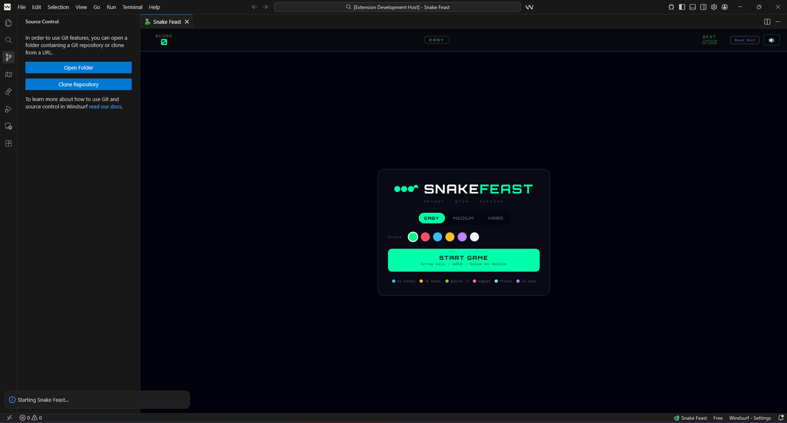
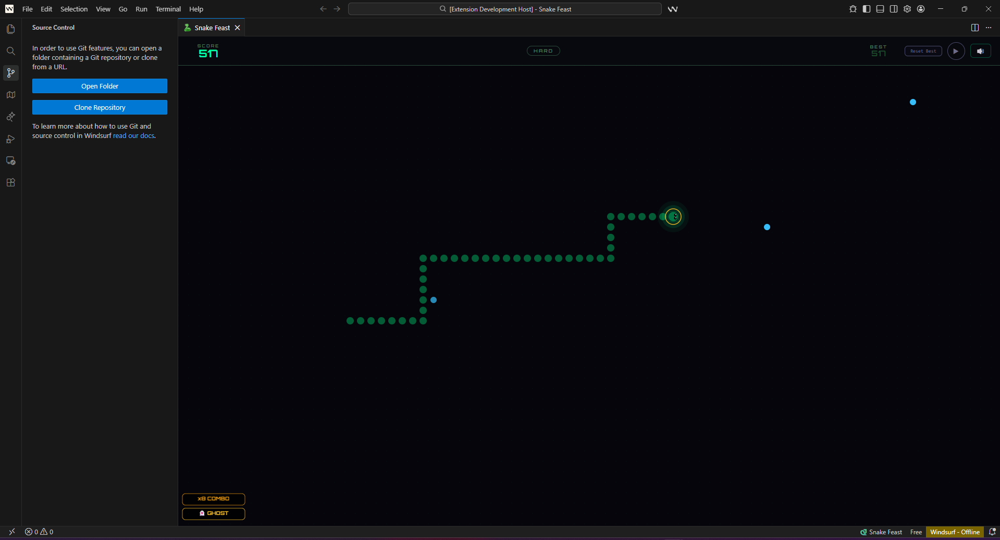
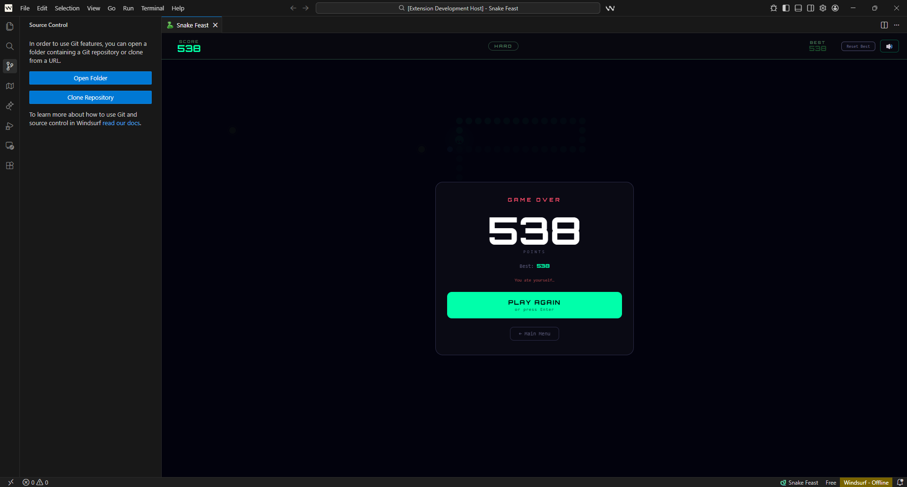

#  Snake Feast -- VS Code Extension

A modern, feature-rich Snake game that lives inside VS Code. Eat food, grow longer, collect power-ups, rack up combos, and chase your high score — without ever leaving your editor.

[](https://marketplace.visualstudio.com/items?itemName=raghul-tech.snake-feast)
[](https://open-vsx.org/extension/raghul-tech/snake-feast)
[](LICENSE)

---

## 🎮 Features

- **Six food types** — normal, bonus, poison, magnet, freeze, and warp, each with unique effects and sounds
- **Three difficulty modes** — Easy, Medium, and Hard, with speed that increases as your snake grows
- **Power-up system** — ghost mode, magnet pull, board freeze, and warp tunneling
- **Combo scoring** — eat foods in quick succession to multiply your points up to ×8
- **Eleven achievements** — unlock badges for milestones like length, score, and power-up use
- **Custom snake color** — six color options to personalize your snake
- **Synthesized sound effects** — every action has a distinct Web Audio API sound, no audio files needed
- **Ambient menu music** — calm chord-based music in the menu, silence during gameplay
- **High score persistence** — best scores saved per difficulty mode across VS Code sessions
- **Keyboard, WASD, and swipe** — full control support

---

## SnapShot

<p align="center">
    
  </a>
</p>

<p align="center">
    
  </a>
</p>

<p align="center">
    
  </a>
</p>

---

## 🚀 How to Launch

**Three ways to start the game:**

| Method | Action |
|---|---|
| Status bar | Click **🐍 Snake Feast** in the bottom-right of VS Code |
| Keyboard shortcut | `Ctrl+Shift+Alt+S` (Windows/Linux) · `Cmd+Shift+Alt+S` (Mac) |
| Command Palette | `Ctrl+Shift+P` → type **Start Snake Feast** |

---

## 🕹 How to Play

| Action | Control |
|---|---|
| Move snake | Arrow keys or WASD |
| Pause / Resume | P, Escape, or ⏸ button |
| Mute / Unmute | 🔊 button in the HUD |
| Reset best score | Reset Best button (resets current mode only) |
| Return to menu | ← Main Menu on game over screen |

---

## 🍎 Food Types

| Color | Type | Effect |
|---|---|---|
| 🔵 Blue | Normal | +1 point |
| 🟡 Yellow star | Bonus | +5 points, activates ghost mode |
| 🟢 Green | Poison | −3 points, shrinks snake |
| 🩷 Pink | Magnet | Pulls nearby food toward the snake |
| 🩵 Cyan | Freeze | Slows food aging |
| 🟣 Purple | Warp | +3 points, activates ghost mode |

---

## 🏆 Achievements

| Icon | Name | How to Unlock |
|---|---|---|
| 🍽 | First Blood | Eat your first food |
| 🔟 | Double Digits | Score 10 points |
| ⭐ | Fifty Feast | Score 50 points |
| 💯 | Century | Score 100 points |
| 🔥 | Hot Streak | Reach a ×3 combo |
| 👻 | Phase Shift | Collect a bonus food |
| 🧲 | Magnetar | Use the magnet power-up |
| ❄ | Cryogenics | Use the freeze power-up |
| ☠ | Toxin Proof | Survive a poison food |
| 🐍 | Slitherer | Reach snake length 15 |
| 🐉 | Great Serpent | Reach snake length 30 |

---

## 🛠 Tech Stack

- **Phaser 3** — game engine for canvas rendering and input
- **Web Audio API** — all sound effects and music synthesized in JavaScript, no audio files
- **VS Code globalState API** — scores and preferences persist across sessions
- **Vanilla JavaScript** — no frameworks, no build tools required

---

## 📣 Links

- [VS Code Marketplace](https://marketplace.visualstudio.com/items?itemName=raghul-tech.snake-feast)
- [Open VSX Registry](https://open-vsx.org/extension/raghul-tech/snake-feast)
- [GitHub Repository](https://github.com/raghul-tech/snake-feast)
- [Report an Issue](https://github.com/raghul-tech/snake-feast/issues)

---

## 📦 Publishing Guide

### VS Code Marketplace

**1. Get a Personal Access Token (PAT)**

- Go to [dev.azure.com](https://dev.azure.com) and sign in with your Microsoft account
- Click your profile icon (top right) → **Personal access tokens** → **New Token**
- Set **Organization** to **All accessible organizations**
- Set **Scopes** to **Marketplace → Manage**
- Copy the token — it won't be shown again

**2. Login with vsce**

```bash
npx vsce login raghul-tech
# Paste your PAT when prompted
```

**3. Package and publish**

```bash
# Package only (creates a .vsix file)
npm run package

# Publish directly
npm run publish

# Or publish a specific version bump
npx vsce publish patch   # 2.0.0 → 2.0.1
npx vsce publish minor   # 2.0.0 → 2.1.0
npx vsce publish major   # 2.0.0 → 3.0.0
```

---

### Open VSX Registry

**1. Get an Open VSX token**

- Go to [open-vsx.org](https://open-vsx.org) and sign in with your GitHub account
- Click your profile icon → **Settings** → **Access Tokens** → **Generate New Token**
- Give it a name and copy the token

**2. Publish with ovsx**

```bash
# Install ovsx if you haven't
npm install -g ovsx

# Publish (it reads your package.json automatically)
ovsx publish -p <your-open-vsx-token>

# Or publish the already-packaged .vsix
ovsx publish snake-feast-2.0.0.vsix -p <your-open-vsx-token>
```

> The `.vsix` file from `npm run package` works for both platforms — package once, publish to both.

---

## 📄 License

GNU General Public License v3.0 — see [LICENSE](LICENSE) for details.