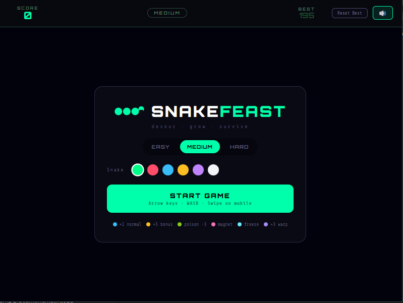
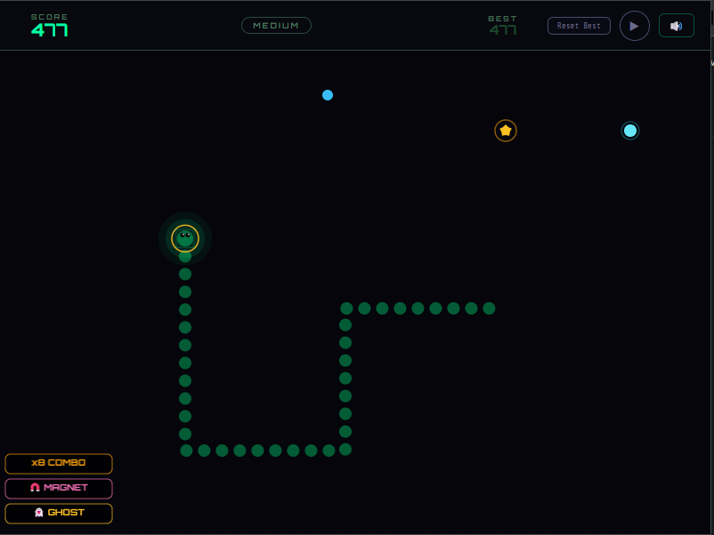
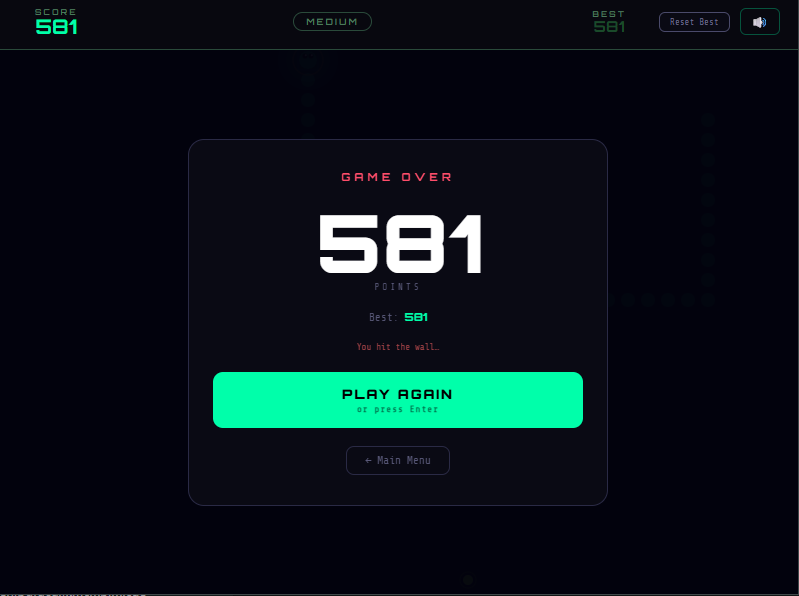

# 🐍 Snake Feast — Browser Extension

A modern, feature-rich Snake game that lives in your browser toolbar. Eat food, grow longer, collect power-ups, rack up combos, and chase your high score — instantly accessible from any tab.

[](https://chromewebstore.google.com/detail/snake-feast/hfmacflbnmdcjlilbnhflplpaaocaohp?authuser=0&hl=en-GB)
[](https://microsoftedge.microsoft.com/addons/detail/snake-feast/jlibkeadeilgolekhdoefckmknpmaiik)
[](https://addons.mozilla.org/en-US/firefox/addon/snake-feast/)
[](LICENSE)

---

## 🎮 Features

- **Six food types** — normal, bonus, poison, magnet, freeze, and warp, each with unique effects and sounds
- **Three difficulty modes** — Easy, Medium, and Hard, with speed that increases as your snake grows
- **Power-up system** — ghost mode, magnet pull, board freeze, and warp tunneling
- **Combo scoring** — eat foods in quick succession to multiply your points up to ×8
- **Achievements** — eleven unlockable badges for milestones like length, score, and power-up use
- **Custom snake color** — six color options to personalize your snake
- **Synthesized sound effects** — every action has a distinct Web Audio API sound, no audio files needed
- **Ambient menu music** — calm chord-based music in the menu, silence during gameplay so you can focus
- **High score persistence** — best scores saved per difficulty mode across sessions
- **Keyboard, WASD, and swipe** — full control support for desktop and touch

---

## SnapShot

<p align="center">
    
  </a>
</p>

<p align="center">
    
  </a>
</p>

<p align="center">
    
  </a>
</p>

---

## 🏗 Project Structure

```text
web-extension/
├── README.md
├── LICENSE
├── source/                  ← All shared game code lives here
│   ├── css/
│   │   ├── googlefonts.css  ← Locally bundled fonts (Orbitron, Share Tech Mono)
│   │   └── style.css        ← All UI and game styles
│   ├── icon/
│   │   ├── 16.png
│   │   ├── 32.png
│   │   ├── 48.png
│   │   ├── 64.png
│   │   └── 256.png
│   ├── js/
│   │   ├── phaser.min.js    ← Phaser 3 game engine (bundled locally)
│   │   ├── scene.js         ← Game scene — snake logic, rendering, food, badges
│   │   ├── score.js         ← ScoreManager — handles localStorage (web) + PyQt bridge (desktop)
│   │   ├── script.js        ← UI wiring, HUD, achievements, Phaser init
│   │   └── sound.js         ← SoundManager — synthesized audio via Web Audio API
│   ├── index.html           ← Main HTML — HUD, menu card, game over card
│   └── sw.js                ← Service worker / background script
│
├── build-chrome/
│   └── manifest.json        ← Manifest V3 for Chrome
│
├── build-edge/
│   └── manifest.json        ← Manifest V3 for Edge
│
└── build-firefox/
    └── manifest.json        ← Manifest V2 for Firefox (uses background.scripts)
```

The `source/` folder contains the complete game. The three `build-*/` folders each contain only their browser-specific `manifest.json`. When building for release, source files are copied into the build folder alongside the manifest (README.md and LICENSE included) and zipped for submission.

---

## 🚀 Installing for Development

### Chrome / Edge

1. Open `chrome://extensions` (Chrome) or `edge://extensions` (Edge)
2. Enable **Developer mode** (toggle in the top right)
3. Click **Load unpacked**
4. Select the `build-chrome/` folder — but first copy all source files into it (see Build section below)

### Firefox

1. Open `about:debugging#/runtime/this-firefox`
2. Click **Load Temporary Add-on**
3. Select the `manifest.json` inside `build-firefox/` — but first copy all source files into it

---

## 📦 Building for Release

Because browsers require `manifest.json` to be at the root of the zip alongside all other files, you cannot zip `source/` and `build-chrome/` separately. Follow these steps for each browser:

### Step-by-step (repeat for each browser)

**1. Copy source files into the build folder**

```bash
# Chrome / Edge
cp -r source/* build-chrome/

# Firefox
cp -r source/* build-firefox/
```

On Windows (PowerShell):
```powershell
Copy-Item -Recurse source\* build-chrome\
Copy-Item -Recurse source\* build-firefox\
```

**2. Zip the contents — not the folder itself**

The zip must contain `manifest.json` at the root level, not inside a subfolder.

```bash
# Chrome
cd build-chrome
zip -r ../snake-feast-chrome.zip .

# Edge (same manifest format as Chrome)
cd ../build-edge
zip -r ../snake-feast-edge.zip .

# Firefox
cd ../build-firefox
zip -r ../snake-feast-firefox.zip .
```

On Windows, open the build folder, select all files inside it, right-click → Send to → Compressed folder.

**3. Submit to stores**

| Store | Submission URL |
|---|---|
| Chrome Web Store | https://chrome.google.com/webstore/devconsole |
| Edge Add-ons | https://partner.microsoft.com/en-us/dashboard/microsoftedge |
| Firefox Add-ons | https://addons.mozilla.org/developers/ |

---

## 🎯 How to Play

| Action | Control |
|---|---|
| Move snake | Arrow keys or WASD |
| Move on mobile | Swipe in any direction |
| Pause / Resume | P, Escape, or ⏸ button |
| Mute / Unmute | 🔊 button in the HUD |
| Reset best score | Reset Best button |
| Return to menu | ← Main Menu on game over screen |

### Food types

| Color | Type | Effect |
|---|---|---|
| 🔵 Blue | Normal | +1 point |
| 🟡 Yellow star | Bonus | +5 points, activates ghost mode |
| 🟢 Green | Poison | −3 points, shrinks snake |
| 🩷 Pink | Magnet | Pulls nearby food toward snake |
| 🩵 Cyan | Freeze | Slows food aging |
| 🟣 Purple | Warp | +3 points, activates ghost mode |

### Power-up badges

Active power-ups are shown as stacked badges in the bottom-left of the game canvas. Multiple power-ups can be active at the same time.

---

## 🔧 Manifest differences by browser

| Feature | Chrome / Edge (MV3) | Firefox (MV2) |
|---|---|---|
| Manifest version | 3 | 2 |
| Popup key | `action` | `browser_action` |
| Background | `background.service_worker` | `background.scripts` |
| CSP format | Object `{ extension_pages: "..." }` | Plain string |
| web_accessible_resources | Array of objects with `matches` | Flat array of strings |

---

## 🛠 Tech Stack

- **Phaser 3** — game engine for canvas rendering and input
- **Web Audio API** — all sound effects and music synthesized in JavaScript, no audio files
- **Vanilla JavaScript** — no frameworks, no build tools required
- **CSS custom properties** — responsive layout works across phone, tablet, and desktop viewports

---

## 📄 License

GNU General Public License v3.0 — see [LICENSE](LICENSE) for details.

This software is free to use, modify, and distribute under the terms of the GPL-3.0. Any derivative works must also be distributed under the same license.

