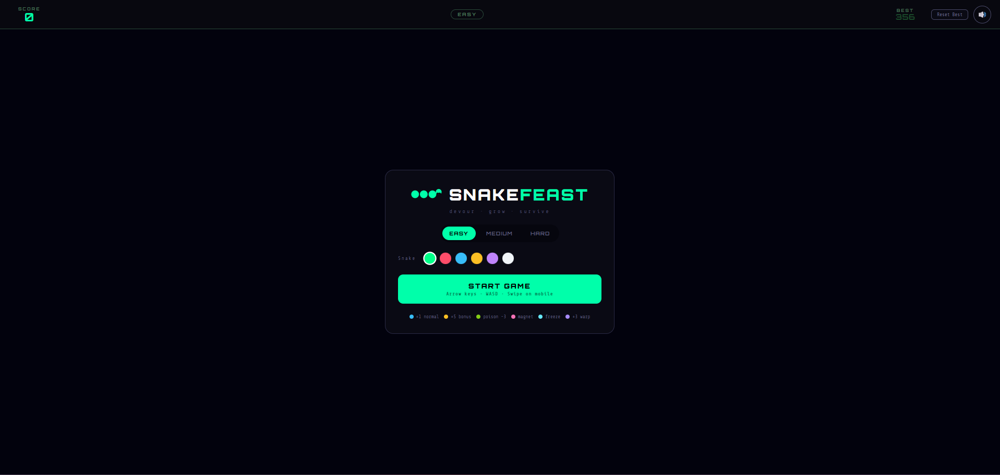
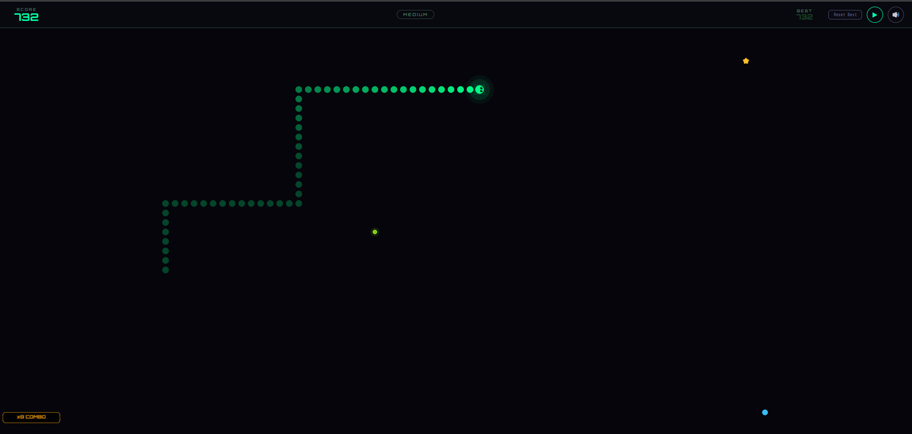
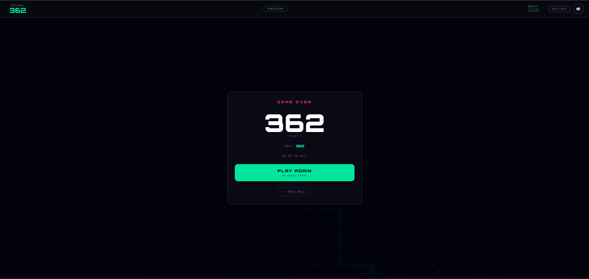

#  Snake Feast

A modern, feature-rich Snake game that runs in your browser. Eat food, grow longer, collect power-ups, rack up combos, and chase your high score — no install needed.

[](https://snake-feast-web.netlify.app/)
[](https://snake-feast-staging.netlify.app/)
[](https://wavedash.com/g/raghul-tech/snake-feast)
[](LICENSE)

---

## 🌐 Live URLs

| Environment | URL |
|---|---|
| 🟢 Production | https://snake-feast-web.netlify.app/ |
| 🟡 Staging | https://snake-feast-staging.netlify.app/ |
| 🟣 Wavedash | https://wavedash.com/g/raghul-tech/snake-feast |

---

## SnapShot

<p align="center">
    
  </a>
</p>

<p align="center">
    
  </a>
</p>

<p align="center">
    
  </a>
</p>

## 🚀 CI/CD — Auto Deploy via Netlify

This project uses **Netlify branch deploys**. Pushing to either branch triggers an automatic deployment — no manual steps needed.

| Branch | Deploys To |
|---|---|
| `staging` | https://snake-feast-staging.netlify.app/ |
| `main` | https://snake-feast-web.netlify.app/ |

### How it works

```
Your machine
    │
    ├── git push origin staging  →  Netlify builds  →  snake-feast-staging.netlify.app
    │
    └── git push origin main     →  Netlify builds  →  snake-feast-web.netlify.app
```

### Typical release flow

```bash
# 1. Work on your feature
git checkout staging
git add .
git commit -m "feat: your change"
git push origin staging
# ✅ Staging deploys automatically — test it at snake-feast-staging.netlify.app

# 2. Once happy, promote to production
git checkout main
git merge staging
git push origin main
# ✅ Production deploys automatically — live at snake-feast-web.netlify.app
```

---

## ⚙️ Netlify Setup (one-time)

If you're setting this up fresh on a new Netlify account:

**1. Connect your repository**
- Go to [app.netlify.com](https://app.netlify.com) → **Add new site** → **Import an existing project**
- Connect your GitHub account and select this repository

**2. Configure the production site**
- Set **Branch to deploy** to `main`
- Build command: *(leave empty — this is a static site)*
- Publish directory: `web` *(the folder containing `index.html`)*
- Click **Deploy site**
- Rename the site to `snake-feast-web` under **Site settings → General**

**3. Configure the staging site**
- Go back to **Add new site** → import the same repository again
- This time set **Branch to deploy** to `staging`
- Same build command and publish directory (`web`)
- Rename this site to `snake-feast-staging`

That's it — every push to either branch auto-deploys from here on.

---

## 🎮 Wavedash — Leaderboards, Achievements & Cloud Saves

Snake Feast is published on [Wavedash](https://wavedash.com), a platform that adds global leaderboards, achievements, cross-device cloud saves, and player stats on top of your existing web game.

### Play on Wavedash

👉 **https://wavedash.com/g/raghul-tech/snake-feast**

Features available on Wavedash that are not in the plain web version:

| Feature | Details |
|---|---|
| 🏆 Global leaderboards | Separate leaderboard per difficulty — Easy, Medium, Hard |
| 🎖 Achievements | 11 unlockable achievements synced to your Wavedash profile |
| ☁️ Cloud saves | Your best scores sync across every device you play on |
| 📊 Stats | Total games played, total score, food eaten tracked globally |
| 👥 Friends | See friends' scores and online status |

### Achievements

| Achievement | How to unlock |
|---|---|
| 🍽 First Blood | Eat your first food |
| 🔟 Double Digits | Score 10 points |
| ⭐ Fifty Feast | Score 50 points |
| 💯 Century | Score 100 points |
| 🔥 Hot Streak | Reach a ×3 combo |
| 👻 Phase Shift | Eat bonus food and activate ghost mode |
| 🧲 Magnetar | Use the magnet power-up |
| ❄ Cryogenics | Freeze the board |
| ☠ Toxin Proof | Survive eating poison food |
| 🐍 Slitherer | Grow your snake to length 15 |
| 🐉 Great Serpent | Grow your snake to length 30 |

---

## 🛠 Wavedash Deploy Guide

This section is for contributors who need to push a new build to Wavedash.

### Prerequisites

Install the Wavedash CLI:

```bash
# Windows (PowerShell)
winget install wavedash

# macOS
brew install wavedash

# Or download from https://wavedash.com/cli
```

### File location

`wavedash.toml` lives **inside the `web/` folder**, next to `index.html`.
You deploy by navigating into `web/` and running the CLI from there.

```
Snake-Feast/
    web/                     ← navigate here before deploying
        wavedash.toml        ← lives here (upload_dir = ".")
        index.html
        css/
        js/
        icon/
    Desktop/
        main.py
```

### wavedash.toml

```toml
# Location: Snake-Feast/web/wavedash.toml
# Run deploy from inside the web/ folder

game_id     = "j97b4rka3q1ebdyagn0ghcsdrs85kg31"
org_slug    = "raghul-tech"
game_slug   = "snake-feast"
branch_slug = "master"
upload_dir  = "."

[custom]
version    = "2.0.0"
entrypoint = "index.html"
```

> ⚠️ `upload_dir = "."` means "upload everything in the same folder as this toml file."
> Since `wavedash.toml` is inside `web/`, the CLI uploads `web/` contents directly.
> Do **not** change this to `"web"` — that would look for `web/web/` which doesn't exist.

### Step-by-step deploy

```bash
# 1. Navigate INTO the web/ folder (where wavedash.toml lives)
cd "C:\Users\Asus HN7180T\OneDrive\Desktop\Git Hub\Snake-Feast\web"

# 2. Log in (only needed once — opens a browser window)
wavedash auth

# 3. Deploy
wavedash build push

# You will see upload progress, then a confirmation URL.
```

### Verify the deploy

1. Go to https://wavedash.com/g/raghul-tech/snake-feast
2. Open browser DevTools → Console tab
3. Play a game — you should see:

```
[Wavedash] Initialising...
[Wavedash] User: YourName | ID: xxx
[Wavedash] Stats loaded: true
[Wavedash] Leaderboard OK: easy → lb-xxx
[Wavedash] Leaderboard OK: medium → lb-xxx
[Wavedash] Leaderboard OK: hard → lb-xxx
[Wavedash] Ready ✓
[Wavedash] My scores loaded: { easy: 0, medium: 0, hard: 0 }
```

4. Die in-game. You should then see:

```
[Wavedash] Score submitted: 42 on easy → rank #1
```

5. Check **Developer Portal → Leaderboards** to confirm the score appears.

### Troubleshooting deploys

| Error | Fix |
|---|---|
| `game not found` | Check `game_id` and `game_slug` in `wavedash.toml` match the portal exactly |
| `not authenticated` | Run `wavedash auth` again |
| `upload_dir not found` | Make sure you are inside `web/` when running `wavedash build push` |
| Blank console on Wavedash | SDK not injecting — check the game is loaded via Wavedash, not a direct URL |
| Achievements not showing | Import `portal-import.json` in Developer Portal → Achievements → Import JSON |

### Import achievements and stats into the portal (one-time)

1. Go to [Wavedash Developer Portal](https://wavedash.com/developer/)
2. Select **Snake Feast**
3. Go to **Achievements → Add achievement → Import JSON**
4. Paste the contents of `achievements.json` from this repo
5. This creates all 11 achievements and 6 stats in one shot

---

## 🎮 Features

- **Six food types** — normal, bonus, poison, magnet, freeze, and warp, each with unique effects and sounds
- **Three difficulty modes** — Easy, Medium, and Hard, with speed that increases as your snake grows
- **Power-up system** — ghost mode, magnet pull, board freeze, and warp tunneling
- **Combo scoring** — eat foods in quick succession to multiply your points up to ×8
- **Eleven achievements** — unlock badges for milestones like length, score, and power-up use
- **Custom snake color** — six color options to personalize your snake
- **Synthesized sound effects** — every action has a distinct Web Audio API sound, no audio files needed
- **Ambient menu music** — calm chord-based music in the menu, silence during gameplay
- **High score persistence** — best scores saved per difficulty mode (localStorage on web, Wavedash cloud on platform)
- **Keyboard, WASD, and swipe** — full control support for desktop and touch
- **Desktop app** — runs as a native window via PyQt5 (`Desktop/main.py`)

---

## 🕹 How to Play

| Action | Control |
|---|---|
| Move snake | Arrow keys or WASD |
| Move on mobile | Swipe in any direction |
| Pause / Resume | P, Escape, or ⏸ button |
| Mute / Unmute | 🔊 button in the HUD |
| Reset best score | Reset Best button (resets current mode only) |
| Return to menu | ← Main Menu on game over screen |

---

## 🍎 Food Types

| Color | Type | Effect |
|---|---|---|
| 🔵 Blue | Normal | +1 point |
| 🟡 Yellow star | Bonus | +5 points, activates ghost mode |
| 🟢 Green | Poison | −3 points, shrinks snake |
| 🩷 Pink | Magnet | Pulls nearby food toward the snake |
| 🩵 Cyan | Freeze | Slows food aging |
| 🟣 Purple | Warp | +3 points, activates ghost mode |

---

## 🛠 Tech Stack

- **Phaser 3** — game engine for canvas rendering and input
- **Web Audio API** — all sound effects and music synthesized in JavaScript, no audio files
- **Wavedash SDK** — leaderboards, achievements, cloud saves, and stats (Wavedash platform only)
- **PyQt5 + QWebEngine** — desktop app wrapper (`Desktop/main.py`)
- **QWebChannel** — Python ↔ JavaScript bridge for desktop score persistence
- **Netlify** — static hosting with automatic branch deploys
- **Vanilla JavaScript** — no frameworks, no build tools required

---

## 📁 Project Structure

```
Snake-Feast/
├── web/                       ← all game files (Netlify publish dir + Wavedash upload)
│   ├── wavedash.toml          # Wavedash deploy config (upload_dir = ".")
│   ├── index.html
│   ├── css/
│   │   ├── style.css
│   │   └── googlefonts.css
│   ├── js/
│   │   ├── phaser.min.js      # Phaser 3 engine (local copy)
│   │   ├── script.js          # Game logic, HUD, achievements
│   │   ├── scene.js           # Phaser scene — snake, food, rendering
│   │   ├── score.js           # ScoreManager — desktop/web score bridge
│   │   ├── sound.js           # SoundManager — Web Audio API
│   │   ├── wavedash.js        # WavedashManager — leaderboards + achievements
│   │   |── qwebchannel.js     # Qt bridge (desktop only)
│   │   └── achievements.json  # Achievement definitions for Wavedash portal
│   └── icon/

```

---

## 📣 Links

- [Play Now (Production)](https://snake-feast-web.netlify.app/)
- [Play on Wavedash](https://wavedash.com/g/raghul-tech/snake-feast)
- [Staging](https://snake-feast-staging.netlify.app/)
- [GitHub Repository](https://github.com/raghul-tech/snake-feast)
- [Report an Issue](https://github.com/raghul-tech/snake-feast/issues)
- [Wavedash Developer Portal](https://wavedash.com/developer/)

---

## 📄 License

GNU General Public License v3.0 — see [LICENSE](LICENSE) for details.